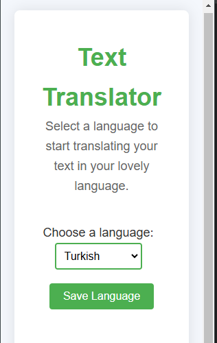
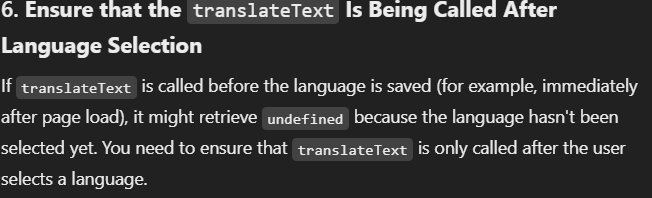
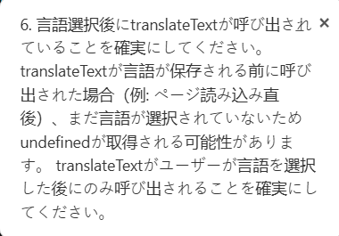

# Language Translation Extension

This project is a comprehensive language translation tool that allows users to translate any selected text into their desired language. The extension integrates seamlessly as a Chrome extension, providing easy and accessible multilingual translation capabilities.

---

## UI Screenshots

| UI Overview                     | Input Text Example           | Translated Text Example      |
|----------------------------------|------------------------------|------------------------------|
|  |  |  |

---

## Folder Structure

### Backend
- **app.py**  
  Contains the API implementation for handling translation requests.
  
- **utils.py**  
  Includes the core translation logic and language processing utilities.

### Frontend
- Contains the code for the Chrome extension interface.
  - **stylecss folder** - Houses all CSS files for styling.
  - **assets folder** - Stores images and icons used in the extension.
  - **scripts folder** - Contains JavaScript files to manage front-end interactions.
  - **popup.html** - Defines the main HTML structure of the extension's pop-up.
  - **manifest.json** - Configuration file for Chrome extension settings.

### Images
- This folder contain the all the necessary images.

---

## Features

- **Multilingual Translation**  
  Easily translate selected text to any language of choice.

- **User-Friendly Chrome Extension**  
  Quick and accessible interface right in the browser.

- **Seamless Backend-Frontend Integration**  
  Efficient API and utility functions for translation with a responsive front-end experience.

---